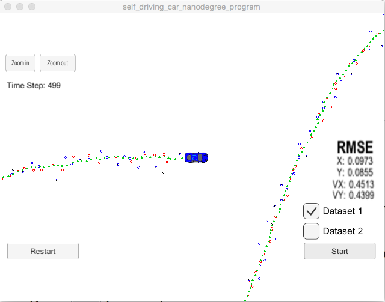

# Extended Kalman Filter Project - Jose C. Marti
Self-Driving Car Engineer Nanodegree Program

In this project I have preformed an Extended Kalman filter in C++.  This is the first project of the Term 2.
 
 
## Compiling

The code compiles without errors with cmake and make.

## Accuracy

The px, py, vx, vy output coordinates have an RMSE <= [.11, .11, 0.52, 0.52] when using the file: "obj_pose-laser-radar-synthetic-input.txt” which is the same data file the simulator uses for Dataset 1. The final obtained values are: [.09, .08, 0.45, 0.43]

## Follows the Correct Algorithm

The Sensor Fusion algorithm:

•	Follows the general processing flow as taught in the lessons.

•	Uses the first measurements to initialize the state vectors and covariance matrices.

•	First predicts then updates.

•	Sets up the appropriate matrices given the type of measurement and calls the correct measurement function for a given sensor type (radar or lidar).

## Code Efficiency

Unnecessary calculations have been tried to be avoided for code sanity.

## Comments

This project is a good warming up for the upcoming projects that we expect during the term.
It was a good opportunity to un-rust my C++ knowledge and to familiarize with the make command.

